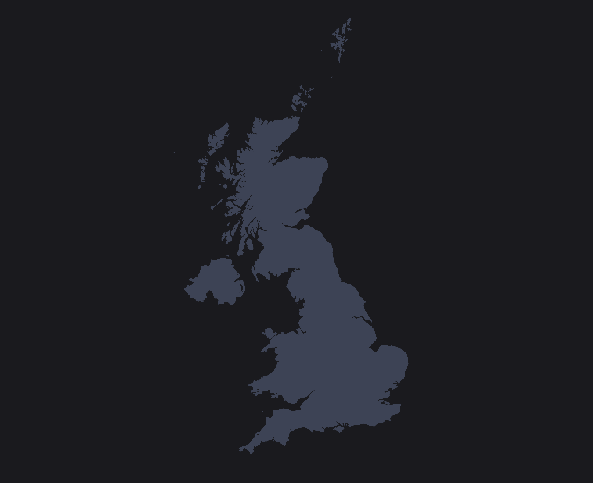

# RailView

A work in progress visualisation of the Darwin open data feeds.

- https://wiki.openraildata.com/index.php/Main_Page

See `research/NOTES.md` for more information and links.

Run the application with `node ./server.js` and visit at `http://localhost:3000`.

